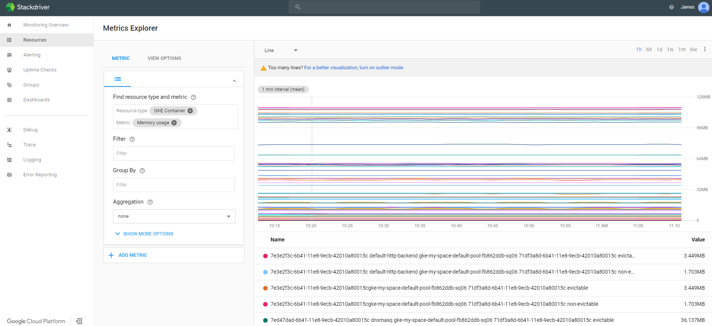
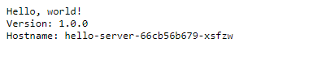
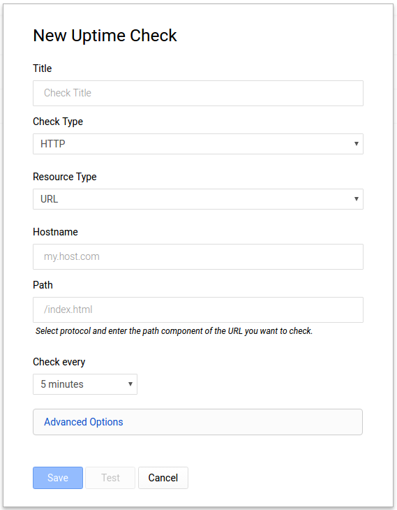

# Monitoring with Stackdriver on Kubernetes Engine

## Table of Contents
* [Introduction](#introduction)
* [Architecture](#architecture)
* [Prerequisites](#prerequisites)
  * [Run Demo in a Google Cloud Shell](#run-demo-in-a-google-cloud-shell)
  * [Supported Operating Systems](#supported-operating-systems)
  * [Install Cloud SDK](#install-cloud-sdk)
  * [Install Terraform](#install-terraform)
  * [Configure Authentication](#configure-authentication)
  * [Enable GCP APIs](#enable-gcp-apis)
* [Deployment](#deployment)
  * [How does it work?](#how-does-it-work)
  * [Running Terraform](#running-terraform)
* [Validation](#validation)
  * [Create a new Stackdriver Account](#create-a-new-stackdriver-account)
  * [Using Metrics Explorer](#using-metrics-explorer)
  * [Setting up a Custom Alert](#setting-up-a-custom-alert)
  * [Creating an Uptime Check](#creating-an-uptime-check)
* [Teardown](#teardown)
* [Troubleshooting](#troubleshooting)
* [Relevant Material](#relevant-material)

## Introduction
Stackdriver Monitoring is used to visualize the performance, uptime, and overall health of your applications.  The Stackdriver Monitoring console allows you to visualize data across all projects in GCP in a single interface.

This tutorial will walk you through setting up Monitoring and visualizing metrics from a Kubernetes Engine cluster.  It makes use of [Terraform](https://www.terraform.io/), a declarative [Infrastructure as Code](https://en.wikipedia.org/wiki/Infrastructure_as_Code) tool that enables configuration files to be used to automate the deployment and evolution of infrastructure in the cloud.  The logs from the Kubernetes Engine cluster will be leveraged to walk through the monitoring capabilities of Stackdriver.

**Note:** The setup of Stackdriver Monitoring is not automated with a script because it is currently not supported through Terraform or via the gcloud command line tool.

## Architecture

The tutorial will create a Kubernetes Engine cluster that has a sample application deployed to it.  The logging and metrics for the cluster are loaded into Stackdriver Logging by default.  In the turorial a Stackdriver Monitoring account will be setup to view the metrics captured.


## Prerequisites

A Google Cloud account and project is required for this.  Access to an existing Google Cloud
project with the Kubernetes Engine service enabled If you do not have a Google Cloud account
please signup for a free trial [here](https://cloud.google.com).

### Run Demo in a Google Cloud Shell

Click the button below to run the demo in a [Google Cloud Shell](https://cloud.google.com/shell/docs/).

[](https://console.cloud.google.com/cloudshell/open?git_repo=https%3A%2F%2Fgithub.com%2FGoogleCloudPlatform%2Fgke-monitoring-tutorial&page=editor&tutorial=README.md&image=gcr.io/graphite-cloud-shell-images/terraform)

This Cloud Shell uses a custom container to install terraform, please select the 'Trust' radio button to
start the custom container when the Cloud Shell starts.

All the tools for the demo are installed. When your shell starts execute the following
command in order to setup gcloud cli.

```console
gcloud init
```

### Supported Operating Systems

This project will run on macOS, Linux, or in a [Google Cloud Shell](https://cloud.google.com/shell/docs/).

### Cloud Project

You'll need access to a Google Cloud Project with billing enabled. See **Creating and Managing Projects** (https://cloud.google.com/resource-manager/docs/creating-managing-projects) for creating a new project. To make cleanup easier it's recommended to create a new project.

### Install Cloud SDK

The Google Cloud SDK is used to interact with your GCP resources. [Installation instructions](https://cloud.google.com/sdk/downloads) for multiple platforms are available online.  If you are using Cloud Shell, the Cloud SDK is already installed.

### Install Terraform

Terraform is used to automate the manipulation of cloud infrastructure. Its [installation instructions](https://www.terraform.io/intro/getting-started/install.html) are also available online.  If you are using Google Cloud Shell terraform is
already intalled.

### Configure Authentication

The Terraform configuration will execute against your GCP environment and create a Kubernetes Engine cluster running a simple application.  The configuration will use your personal account to build out these resources.  To setup the default account the configuration will use, run the following command to select the appropriate account:

```console
$ gcloud auth application-default login
```

### Enable GCP APIs

In order for the deployment automation to work, the following APIs need to be enabled:
* Kubernetes Engine API
* Stackdriver Logging API
* Stackdriver Monitoring API

You can enable them using the following command:

```console
$ gcloud services enable container.googleapis.com \
   logging.googleapis.com monitoring.googleapis.com
```

## Deployment

### How does it work?

Following the principles of [Infrastructure as Code](https://en.wikipedia.org/wiki/Infrastructure_as_Code) and [Immutable Infrastructure](https://www.oreilly.com/ideas/an-introduction-to-immutable-infrastructure), Terraform supports the writing of declarative descriptions of the desired state of infrastructure. When the descriptor is applied, Terraform uses GCP APIs to provision and update resources to match. Terraform compares the desired state with the current state so incremental changes can be made without deleting everything and starting over.  For instance, Terraform can build out GCP projects and compute instances, etc., even set up a Kubernetes Engine cluster and deploy applications to it. When requirements change, the descriptor can be updated and Terraform will adjust the cloud infrastructure accordingly.

This example will start up a Kubernetes Engine cluster and deploy a simple sample application to it. By default, Kubernetes Engine clusters in GCP are provisioned with a pre-configured [Fluentd](https://www.fluentd.org/)-based collector that forwards logs to Stackdriver.

### Running Terraform

#### One-time configuration
The Terraform configuration takes two parameters to determine where the Kubernetes Engine cluster should be created:

* project
* zone

For simplicity, these parameters can be specified in a file named `terraform.tfvars`, in the `terraform` directory. To generate this file based on your gcloud defaults, run:

```console
$ ./terraform/generate-tfvars.sh
```

This will generate a `terraform/terraform.tfvars` file with `project` and `zone` values set. The values will match the output of `gcloud config list`:

```
project="YOUR_PROJECT"
zone="YOUR_ZONE"
```

If you need to override any of the defaults, simply replace the desired value(s) to the right of the equals sign(s). Be sure your replacement values are still double-quoted.

#### Deploying the cluster

There are three Terraform files provided with this example in the `terraform` directory. The first one, `main.tf`, is the starting point for Terraform. It describes the features that will be used, the resources that will be manipulated, and the outputs that will result. The second file is `provider.tf`, which indicates which cloud provider and version will be the target of the Terraform commands--in this case GCP. The final file is `variables.tf`, which contains a list of variables that are used as inputs into Terraform. Any variables referenced in the `main.tf` that do not have defaults configured in `variables.tf` will result in prompts to the user at runtime.

You will need to run Terraform commands from the `terraform` directory. Enter:

```console
$ cd terraform
```

Given that authentication was [configured](#configure-authentication) above, we are now ready to run Terraform. In order to establish the beginning state of your cloud infrastructure you must first initialize Terraform:

```console
$ terraform init
```

This will create a hidden directory called `.terraform` in your current working directory and populate it with files used by Terraform.

It is a good practice to do a dry run of Terraform prior to running it:

```console
$ terraform plan
```

`plan` will prompt for any variables that do not have defaults and will output all the changes that Terraform will perform when applied. If everything looks good then it is time to put Terraform to work assembling your cloud infrastructure:

```console
$ terraform apply
```

You will need to enter any variables that don't have defaults provided in `terraform.tfvars`. If no errors are displayed then after a few minutes you should see your Kubernetes Engine cluster in the [GCP Console](https://console.cloud.google.com/kubernetes).

## Validation

In this section we will create a Stackdriver Monitoring account so that we can explore the capabilities of the Monitoring console.

### Create a new Stackdriver Account

The following steps are used to setup a Stackdriver Monitoring account.
1. Visit the **Monitoring** section of the GCP Console.  This will launch the process of creating a new Monitoring console if you have not created one before.
2. On the **Create your free StackDriver account** page select the project you created earlier.  **Note:** You cannot change this setting once it is created.
3. Click on the **Create Account** button.
4. On the next page, **Add Google Cloud Platform projects to monitor** you can leave this alone since the project is already selected it isn't necessary to select any other projects.  **Note:** You can add and remove projects at a later date if necessary.
5. Click the **Continue** button.
6. On the **Monitor AWS accounts** page you can choose to specify your AWS account information or skip this step.
7. For this tutorials purposes you can click the **Skip AWS Setup** button.
8. On the **Install the Stackdriver Agents** page you are provided with a script that can be used to add the Stackdriver Monitoring and Logging agents on each of your VM instances.  **Note:** The tracking of VM's is not automatic like it is for Kubernetes Engine.  For the purposes of this tutorial this script is not needed.
9. Click the **Continue** button.
10. On the **Get Reports by Email** page you can simply select any of the options depending on whether you want to receive the reports.  For the purposes of this demo we will not be using the reports.
11. Click the **Continue** button.
12. The actual creation of the account and underlying resources takes a few minutes.  Once completed you can press the **Launch monitoring** button.

### Using Metrics Explorer

Metrics Explorer is a simple way for viewing metrics quickly.  The following steps are detail out how to use the Metrics Explorer:

1. Click on the menu **Resources -> Metrics Explorer** to bring up the **Metrics Explorer** screen.
2. In the **Find resource type and metric** option type **GKE Container**.
3. This will give you a listing of all metrics related to **GKE Container**.  Select the **Memory usage** metric.
4. This will graph the **GKE Container -> Memory usage** on the right hand of the page.  The screen should look similar to the following, but likely won't show as much timeseries history if the cluster and Stackdriver account was recently created:



You can further update the screen by adding additional metrics, or further customizing the metric you already added (by including specific filtering, grouping, aggregation, etc.).

### Setting up a Custom Alert

The **Alerting** capability in Stackdriver Monitoring allows you to define alert policies which contain conditions such as looking for a metric exceeding a threshold that trigger notifications to a channel such as email, sms message and hipchat.  Alerts that trigger will create an incident which are recorded and tracked for historical reporting. Once the conditions of the alert are no longer satisfied, the incident is automatically closed.

The following steps describe how to create the an alert for a threshold condition.

1. In the console click on the **Alerting -> Create a policy** option.
2. Click on the **Add condition** button.
3. The **Selection condition type** page is displayed.  This page allows you to select various condition types that you want to measure.
4. Click on the **Select** button in the **Metric Threshold** section.
5. On the **Add Metric Threshold Condition** page we can specify the specific metric we want to monitor.  On this page enter the following criteria:
* Resource Type - GKE Container
* Applies To - Group
* If Metric - CPU Utilization
* Condition - above
* Threshold - 70%
* For - 1 Minute
6. Click on the **Save** button.
7. In the **Notifications** section leave the type as Email, and enter in an email account that you can access.
8. In the **Documentation** section enter a custom message.
9. In the **Name this policy** section enter a name for the alert (i.e. GKE CPU Utilization Alert).
10. Click on the **Save Policy** button.

### Creating an Uptime Check

Stackdriver Uptime Checks can be configured to verify that your services or applications are up and accessible.  The checks can be performed from various locations around the world, and the results can be used to enable alerting policies, as well as direct monitoring from the uptime-check dashboard.  This section will discuss the process for creating an uptime-check for the application hosted inside the Kubernetes Engine container.  **Note:** With each Stackdriver account you can have up to 100 uptime-checks.

The following steps should be followed to create an uptime-check.

To begin with we need to have an application or URL to monitor.  The Kubernetes Engine container contains a simple application that can be used for this.  Follow the steps to get the IP address to use to setup this test.

1. In the GCP console navigate to the **Networking -> Network services** page.
2. On the default **Load balancing** page that shows up, click on the TCP load balancer that was setup.
3. On the **Load balancer details** page there is a top section labeled **Frontend**.  Note the IP:Port value as this will be used in the upcoming steps.

Using the IP:Port value you can now access the application.  Go to a browser and enter the URL.  The browser should return a screen that looks similar to the following:



The following steps describe how to create the uptime-check.

1. Navigate to the Stackdriver Monitoring console in your browser.
2. In the console click on the **Uptime Checks -> Uptime Check Overview** option.
3. This brings you to the main **Uptime Checks** page.  Click on the **Create an Uptime Check** button.
4. This will bring up the **New Uptime Check** page.  The screen will look like the following:



On this page enter the following parameters:
  * Title - Uptime Test Check
  * Check Type - HTTP (Should be the default)
  * Resource Type - URL (Should be the default)
  * Hostname - Enter just the IP address that was obtained above
  * Path - Leave this blank
  * Check every - 1 minute
  * Click on **Advanced Options**
  * Port - 8080
5. Click on the **Test** button to verify that all the information you entered was correct.  If it doesn't give you a 200 return code go back and check the values entered above.
6. Click on the **Save** button to save your entry.
7. From the **Uptime Checks** page you can review and monitor the results of your check.

## Teardown

When you are finished with this example, and you are ready toclean up the resources that were created so that you avoid accruing charges, you can run the following Terraform command to remove all resources :

```
$ terraform destroy
```

Terraform tracks the resources it creates so it is able to tear them all back down.

## Troubleshooting

** The install script fails with a `Permission denied` when running Terraform.**
The credentials that Terraform is using do not provide the
necessary permissions to create resources in the selected projects. Ensure
that the account listed in `gcloud config list` has necessary permissions to
create resources. If it does, regenerate the application default credentials
using `gcloud auth application-default login`.

** Metrics Not Appearing or Uptime Checks not executing **
After the scripts execute it may take a few minutes for the Metrics or Uptime Checks to appear.  Configure the items and give the system some time to generate metrics and checks as they someimes take time to complete.

## Relevant Material
* [Kubernetes Engine Monitoring](https://cloud.google.com/kubernetes-engine/docs/how-to/monitoring)
* [Stackdriver Kubernetes Monitoring](https://cloud.google.com/monitoring/kubernetes-engine/)
* [Managing Uptime Checks](https://cloud.google.com/monitoring/uptime-checks/management)
* [Terraform Google Cloud Provider](https://www.terraform.io/docs/providers/google/index.html)


**This is not an officially supported Google product**
