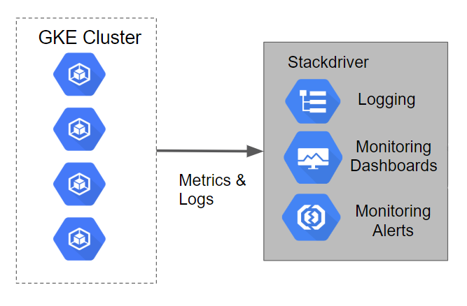

# Monitoring with Stackdriver on Kubernetes Engine

## Table of Contents
* [Introduction](#introduction)
* [Architecture](#architecture)
* [Prerequisites](#prerequisites)
  * [Cloud Project](#cloud-project)
  * [Install Cloud SDK](#install-cloud-sdk)
  * [Install Kubectl](#install-kubectl)
  * [Install Terraform](#install-terraform)
  * [Configure Authentication](#configure-authentication)
* [Deployment](#deployment)
  * [How does it work?](#how-does-it-work)
  * [Running Terraform](#running-terraform)
    * [One\-time configuration](#one-time-configuration)
    * [Deploying the cluster](#deploying-the-cluster)
* [Validation](#validation)
  * [Create a new Stackdriver Account](#create-a-new-stackdriver-account)
  * [Using Stackdriver Kubernetes Monitoring](#using-stackdriver-kubernetes-monitoring)
    * [Native Prometheus integration](#native-prometheus-integration)
* [Teardown](#teardown)
* [Troubleshooting](#troubleshooting)
* [Relevant Material](#relevant-material)


## Introduction
[Stackdriver Kubernetes Monitoring](https://cloud.google.com/monitoring/kubernetes-engine/) is a new Stackdriver feature that more tightly integrates with GKE to better show you key stats about your cluster and the workloads and services running in it. Included in the new feature is functionality to import, as native Stackdriver metrics, metrics from pods with Prometheus endpoints. This allows you to use Stackdriver native alerting functionality with your Prometheus metrics without any additional workload.

This tutorial will walk you through setting up Monitoring and visualizing metrics from a Kubernetes Engine cluster.  It makes use of [Terraform](https://www.terraform.io/), a declarative [Infrastructure as Code](https://en.wikipedia.org/wiki/Infrastructure_as_Code) tool that enables configuration files to be used to automate the deployment and evolution of infrastructure in the cloud.  The logs from the Kubernetes Engine cluster will be leveraged to walk through the monitoring capabilities of Stackdriver.

**Note:** The setup of the Stackdriver Monitoring workspace is not automated with a script because it is currently not supported through Terraform or via the gcloud command line tool.

## Architecture

The tutorial will create a Kubernetes Engine cluster that has a sample application deployed to it.  The logging and metrics for the cluster are loaded into Stackdriver Logging by default.  In the turorial a Stackdriver Monitoring account will be setup to view the metrics captured.



## Prerequisites

The steps described in this document require the installation of several tools and the proper configuration of authentication to allow them to access your GCP resources.

### Cloud Project

You'll need access to a Google Cloud Project with billing enabled. See [Creating and Managing Projects](https://cloud.google.com/resource-manager/docs/creating-managing-projects) for creating a new project. To make cleanup easier it's recommended to create a new project.

### Install Cloud SDK

The Google Cloud SDK is used to interact with your GCP resources. [Installation instructions](https://cloud.google.com/sdk/downloads) for multiple platforms are available online.

### Install Kubectl

Once you have the Google Cloud SDK installed we can use it to install Kubectl.
This is accomplished by executing the following command:

```console
$ gcloud components install kubectl
```

### Install Terraform

Terraform is used to automate the manipulation of cloud infrastructure. Its [installation instructions](https://www.terraform.io/intro/getting-started/install.html) are also available online.

### Configure Authentication

The Terraform configuration will execute against your GCP environment and create a Kubernetes Engine cluster running a simple application.  The configuration will use your personal account to build out these resources.  To setup the default account the configuration will use, run the following command to select the appropriate account:

```console
$ gcloud auth application-default login
```

## Deployment

### How does it work?

Following the principles of [Infrastructure as Code](https://en.wikipedia.org/wiki/Infrastructure_as_Code) and [Immutable Infrastructure](https://www.oreilly.com/ideas/an-introduction-to-immutable-infrastructure), Terraform supports the writing of declarative descriptions of the desired state of infrastructure. When the descriptor is applied, Terraform uses GCP APIs to provision and update resources to match. Terraform compares the desired state with the current state so incremental changes can be made without deleting everything and starting over.  For instance, Terraform can build out GCP projects and compute instances, etc., even set up a Kubernetes Engine cluster and deploy applications to it. When requirements change, the descriptor can be updated and Terraform will adjust the cloud infrastructure accordingly.

This example will start up a Kubernetes Engine cluster and deploy a simple sample application to it. By default, Kubernetes Engine clusters in GCP are provisioned with a pre-configured [Fluentd](https://www.fluentd.org/)-based collector that forwards logs to Stackdriver.

### Running Terraform

#### One-time configuration
The Terraform configuration takes two parameters to determine where the Kubernetes Engine cluster should be created:

* project
* zone

For simplicity, these parameters can be specified in a file named `terraform.tfvars`, in the `terraform` directory. To generate this file based on your gcloud defaults, run:

```console
$ ./scripts/generate-tfvars.sh
```

This will generate a `terraform/terraform.tfvars` file with `project` and `zone` values set. The values will match the output of `gcloud config list`:

```
project="YOUR_PROJECT"
zone="YOUR_ZONE"
```

If you need to override any of the defaults, simply replace the desired value(s) to the right of the equals sign(s). Be sure your replacement values are still double-quoted.

#### Deploying the cluster

There are three Terraform files provided with this example in the `terraform` directory. The first one, `main.tf`, is the starting point for Terraform. It describes the features that will be used, the resources that will be manipulated, and the outputs that will result. The second file is `provider.tf`, which indicates which cloud provider and version will be the target of the Terraform commands--in this case GCP. The final file is `variables.tf`, which contains a list of variables that are used as inputs into Terraform. Any variables referenced in the `main.tf` that do not have defaults configured in `variables.tf` will result in prompts to the user at runtime.

You will need to run Terraform commands from the `terraform` directory. Enter:

```console
$ cd terraform
```

Given that authentication was [configured](#configure-authentication) above, we are now ready to run Terraform. In order to establish the beginning state of your cloud infrastructure you must first initialize Terraform:

```console
$ terraform init
```

This will create a hidden directory called `.terraform` in your current working directory and populate it with files used by Terraform.

It is a good practice to do a dry run of Terraform prior to running it:

```console
$ terraform plan
```

`plan` will prompt for any variables that do not have defaults and will output all the changes that Terraform will perform when applied. If everything looks good then it is time to put Terraform to work assembling your cloud infrastructure:

```console
$ terraform apply
```

You will need to enter any variables that don't have defaults provided in `terraform.tfvars`. If no errors are displayed then after a few minutes you should see your Kubernetes Engine cluster in the [GCP Console](https://console.cloud.google.com/kubernetes).

## Validation

In this section we will create a Stackdriver Monitoring account so that we can explore the capabilities of the Monitoring console.

### Create a new Stackdriver Account

The following steps are used to setup a Stackdriver Monitoring account.
1. Visit the **Monitoring** section of the GCP Console.  This will launch the process of creating a new Monitoring console if you have not created one before.
2. On the **Create your free StackDriver account** page select the project you created earlier.  **Note:** You cannot change this setting once it is created.
3. Click on the **Create Account** button.
4. On the next page, **Add Google Cloud Platform projects to monitor** you can leave this alone since the project is already selected it isn't necessary to select any other projects.  **Note:** You can add and remove projects at a later date if necessary.
5. Click the **Continue** button.
6. On the **Monitor AWS accounts** page you can choose to specify your AWS account information or skip this step.
7. For this tutorials purposes you can click the **Skip AWS Setup** button.
8. On the **Install the Stackdriver Agents** page you are provided with a script that can be used to add the Stackdriver Monitoring and Logging agents on each of your VM instances.  **Note:** The tracking of VM's is not automatic like it is for Kubernetes Engine.  For the purposes of this tutorial this script is not needed.
9. Click the **Continue** button.
10. On the **Get Reports by Email** page you can simply select any of the options depending on whether you want to receive the reports.  For the purposes of this demo we will not be using the reports.
11. Click the **Continue** button.
12. The actual creation of the account and underlying resources takes a few minutes.  Once completed you can press the **Launch monitoring** button.

### Using Stackdriver Kubernetes Monitoring

For a thorough guide on how to observe your cluster with the new Stackdriver Kubernetes UI, see [https://cloud.google.com/monitoring/kubernetes-engine/observing](Observing your Kubernetes Clusters).

#### Native Prometheus integration

The Terraform code included a Stackdriver alerting policy that is watching a metric that was originally imported from a Prometheus endpoint.
From the Stackdriver main page, click on `Alerting` then `Policies Overview` to show all the policies, including the alerting policy called `Prometheus mem alloc`. Clicking on the policy will provide much more detail.


## Teardown

When you are finished with this example, and you are ready to clean up the resources that were created so that you avoid accruing charges, you can run the following Terraform command to remove all resources :

```
$ terraform destroy
```

Terraform tracks the resources it creates so it is able to tear them all back down.

## Troubleshooting

** The install script fails with a `Permission denied` when running Terraform.**
The credentials that Terraform is using do not provide the
necessary permissions to create resources in the selected projects. Ensure
that the account listed in `gcloud config list` has necessary permissions to
create resources. If it does, regenerate the application default credentials
using `gcloud auth application-default login`.

** Metrics Not Appearing or Uptime Checks not executing **
After the scripts execute it may take a few minutes for the Metrics or Uptime Checks to appear.  Configure the items and give the system some time to generate metrics and checks as they someimes take time to complete.

## Relevant Material
* [Stackdriver Kubernetes Monitoring](https://cloud.google.com/monitoring/kubernetes-engine/)
* [Terraform Google Cloud Provider](https://www.terraform.io/docs/providers/google/index.html)


**This is not an officially supported Google product**
